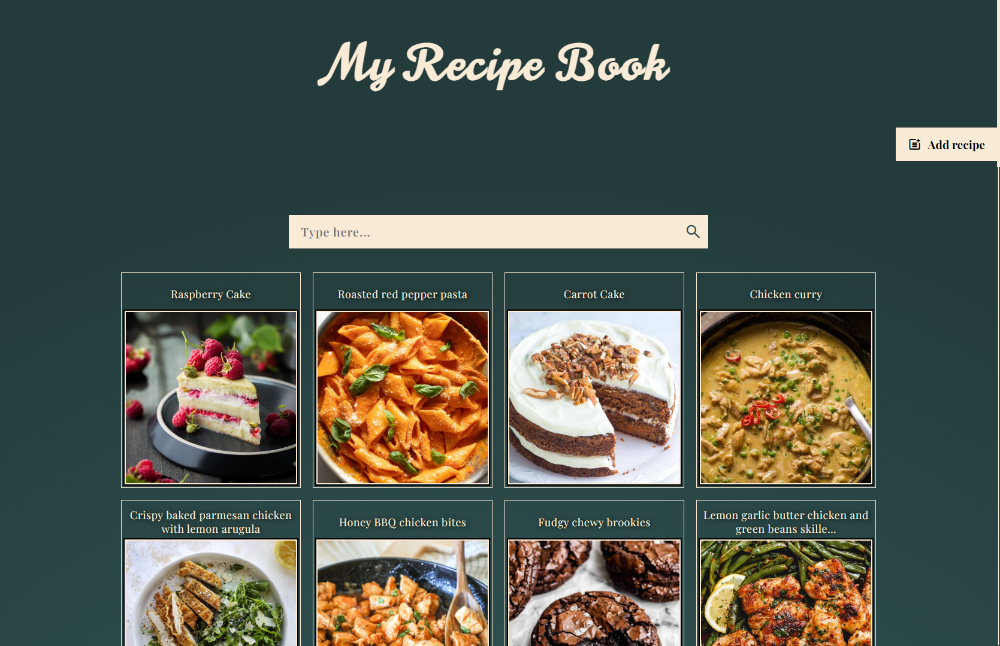

# 📖 My Recipe Book

## 📚 Table of contents

- [Overview](#Overview)
- [Features](#features)
- [Built with](#built-with)

## Overview

My Recipe Book is a dynamic and user-friendly recipe management application where users can add, edit, and delete their favorite recipes. It's built with modular JavaScript, and features a clean, responsive UI that works seamlessly across devices. Whether you're organizing your meals or building a digital cookbook, this app makes it simple and efficient.

## Features
🍲 **Recipe List View:** View all saved recipes in a structured list layout.

➕ **Add New Recipes:** Create new recipes by entering a title, ingredients, and instructions.

✏️ **Edit Recipes:** Modify any existing recipe with an intuitive edit interface.

🗑️ **Delete Recipes:** Remove recipes you no longer need.

🛢️ **Database Storage (MongoDB):** All recipe data is stored securely in a MongoDB database via a RESTful API.

📱 **Fully Responsive Design:** The UI adjusts seamlessly to mobile, tablet, and desktop screens.

## Built With

- HTML 
- CSS
- Vanilla JavaScript
- Node.js
- Express.js
- MongoDB
